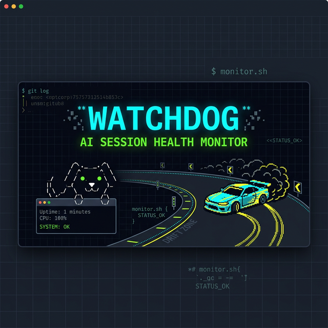

# Watchdog
<div align="center">
  
  <h3>(ŏ_ŏ  ) AI Session Immune System</h3>
  <p>Like <code>/btw</code> for session health — always sensing in the background, only nudging you when something's off.</p>
</div>

# Watchdog (`/btw`)

Watchdog is a lightweight, ambient health monitor (Skill) for Claude Code. Unlike heavy external evaluation pipelines, Watchdog acts as a **built-in immune system** that leverages Claude's own context to constantly assess session health without burning tokens or blocking your workflow.

If the session is healthy, it remains completely silent. If it detects drift, looping, or context decay, it provides a gentle, dismissible ASCII-art nudge.

## Architecture: The Three Layers

1. **Layer 1: Signal Collector (Passive)**: Runs featherweight local checks (`git status`, `uptime`, basic heuristics) before Claude even reads the prompt.
2. **Layer 2: Self-Assessment (Ambient)**: Claude uses the existing session context to evaluate health based on structured rubrics. Zero extra AI calls. Zero wait time.
3. **Layer 3: Ambient Overlay (UI)**: A non-intrusive, single-line Kaomoji terminal output that only appears during `WARNING` or `CRITICAL` states.

*Optional*: The original **Deep Mode** (`--deep`) remains available, offloading the evaluation to an independent external model (Gemini/Codex) for a comprehensive, multi-dimensional health report when things get really stuck.

---

## 🚀 Quick Start

## What It Detects

| Dimension | What It Catches |
|-----------|----------------|
| **Stuck** | Edit-revert loops, build failures, dependency deadlocks |
| **Drift** | Rabbit holes, scope creep, refactoring traps |
| **Hallucination** | Phantom files, non-existent APIs, false assumptions |
| **Context Decay** | Memory loss, repeated reads, forgotten constraints |
| **Velocity Drop** | Declining output, exploration without progress |

## Output

Your session is a car. The watchdog sits trackside. Its mood tells you everything.

```
(ᵕ᷄ ᐛ ᵕ᷅)  zzZ     napping — all clear
(ŏ_ŏ  )  woof?    ears up — something's off
(ง •̀_•́)ง  WOOF!    barking — major trouble
(╬ Ò ‸ Ó)  AWOOO!   biting — total meltdown
```

```
(ᵕ᷄ ᐛ ᵕ᷅)  zzZ...  08 ──🚗── clear track, napping

(ŏ_ŏ  )  woof?  35 ─🚗〰─ tires slipping → steer back

(ง •̀_•́)ง  WOOF! WOOF!  62 〰🚗〰〰
off the main track! smells like burning hallucinations
→ pit stop: run --deep to check the route map

(╬ Ò ‸ Ó)  AWOOO—!!  85 💥🚗〰〰
deadlock wall crash! leash snapped!!
→ kill the engine NOW! [stop / force continue]
```

Includes macOS sound effects that escalate with bark volume.

## Install

**Prerequisites:** [Claude Code](https://docs.anthropic.com/en/docs/claude-code), [jq](https://jqlang.github.io/jq/), and optionally [Gemini CLI](https://github.com/google-gemini/gemini-cli) or [Codex CLI](https://github.com/openai/codex) for Deep Mode.

```bash
git clone https://github.com/VictorVVedtion/watchdog-skill.git
cd watchdog-skill
./install.sh /path/to/your/project
```

Or manually: copy `SKILL.md` + `modules/` to `.claude/skills/watchdog/`, append `CLAUDE.md` to your project's `CLAUDE.md`.

## Usage

```bash
/watchdog                       # quick check (default, zero cost)
/watchdog --deep                # external AI diagnosis
/watchdog --report              # full report with trend history
/watchdog --auto --interval 5   # auto-monitor every N interactions
/watchdog --status              # check monitoring status
/watchdog --off                 # disable auto monitoring
/watchdog --reset               # reset state files
/watchdog --evaluator codex     # use Codex instead of Gemini
```

## Design

Inspired by Claude Code's `/btw` — ambient awareness, minimal interruption, only surfaces when something's actually wrong.

- **Silent by default** — healthy sessions produce zero output
- **Read-only** — never touches your code
- **Progressive** — quick self-check → deep external diagnosis
- **Graceful degradation** — works without Gemini/Codex, works without git history

## Cost

Quick Mode: free (uses existing session context).
Deep Mode: ~$0.03/check. Gemini free tier covers most use cases.

## License

[MIT](LICENSE)
